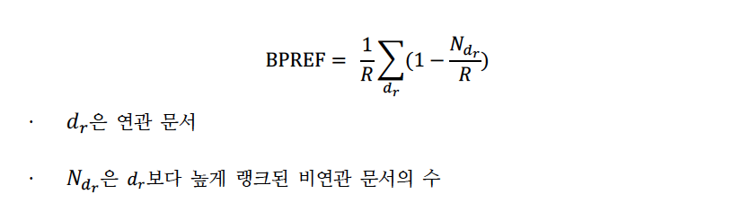
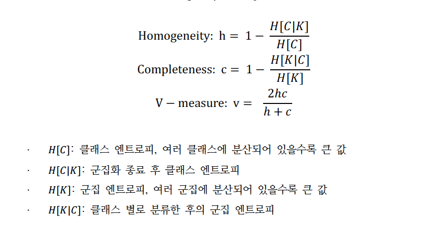

406.426B 데이터관리와 분석
2021년 1학기

# Project #3: Document search engine & Classification and Clustering
## 프로젝트의 목표:
본 프로젝트는 텍스트 데이터에 대해 검색 엔진 모듈, 분류 및 군집화 모델 구현을 목적으로 한다.
본 프로젝트는 크게 두 부분으로 나뉜다.
  
PART Ⅰ. 문서 검색 엔진 
PART Ⅱ. 문서 분류 및 군집화 
PART Ⅰ. 문서 검색 엔진 
 
PART Ⅰ에서는 주어진 질의어와 관련이 높은 순서대로 문서들을 나열하는 검색 엔진 모듈을 python
의 whoosh 라이브러리를 사용하여 구현하여야 한다.

- 사용 데이터: Cranfield 데이터셋
    - document.txt: 1,400개 문서 파일
    - query.txt: 225개 질의어 파일
    - relevance.txt: 각 질의어의 실제 연관 문서가 명시된 정답 파일
-  작성 모듈
    - [선택] make_index.py: 문서의 ID와 contents를 index에 저장하는 함수. 기본으로 주어진 index를 사용하지 않을 시에 해당 모듈 작성
    - QueryResult.py: 텍스트 형태의 질의어를 입력 받아 whoosh 질의어 객체로 변환 후 검
    색 결과 반환
    - CustomScoring.py: 문서들을 질의어와 관련 높은 순서대로 나열할 때 사용하는 문서 채
    점 함수. 
    - 사용 가능한 기본 정보로는
        1. 문서 내 단어 빈도 (TF)
        2. 역문서 빈도 (IDF)
        3. 전체 데이터셋 내 단어 빈도
        4. 문서 개수
        5. 문서 길이 (단어 개수)
        6. 전체 데이터셋 내 단어 개수
        7. 문서 당 평균 단어 개수  
        
    등이 있으며, 제공되는 정보 이외의 정보를 추출 가능하다면 추가적으로 사용 가능

- 평가 방법
    - 225개의 질의어 중 임의로 정해진 37개의 test 질의어에 대한 검색 성능 평가
    - 평가 지표로는 BPREF 사용 [ evaluate.py에서 자동으로 계산 ]
      
    
      

- 점수 산정: 총 35점
    - 성능 평가 점수 20점: 37개 test 질의어의 평균 BPREF을 [0.5, 1] scale한 후 * 20
    - 성능 개선 방법에 대한 근거와 정당화 내용 15점: 절대평가
- 주의 사항
    - 제공되는 질의어에 test 질의어가 포함된 프로젝트 상황 특성을 활용한 질의어–문서 매
    칭 금지
    => 성능 개선 방법에 대한 근거 점수, 성능 평가 점수 모두 0점
    - 문서 분석은 허용, 질의어 분석은 금지

     
     
## PART Ⅱ. 문서 분류 및 군집화
PART Ⅱ에서는 The New York Times의 영어 신문 기사를 분류, 군집화하는 모델을 python의 sklearn
라이브러리를 사용하여 구현하여야 한다.
- (R2-1) 영어 신문 기사 분류  
    - opinion, business, world, us, arts, sports, books, movies 총 8개의 카테고리
    - 각 카테고리마다 약 300개의 기사 데이터 제공
    - text 폴더 내부에 train/test 폴더 구분, 각 폴더 내에 8개의 카테고리를 이름으로 하는 폴더 내
    에 텍스트 파일로 존재
    - test 폴더에는 각 카테고리별 가장 최근 날짜의 기사 약 5개 정도만 존재
    - 주어진 데이터 외에 추가로 크롤링 등의 방법을 이용한 데이터 추가, 파일 수정, 제공된 데이
    터셋 일부만 사용은 허용하지 않음
    - 2021.06.09(프로젝트 마감일) 이후 작성된 기사 30개에 대해 올바르게 분류한 개수로 성능 평
    가
    - 각 모델에 대해 학습시킨 모델을 pickle 파일로 저장하여 코드와 함께 제출
     
     
1. 2-1-1. Naı̈ve Bayes Classifier
    - 점수 15점: 30개 신문 기사 중 올바르게 분류한 개수 * 0.5
2. 2-1-2. SVM
    - 점수 15점: 30개 신문 기사 중 올바르게 분류한 개수 * 0.5
       
- (R2-2) 영어 신문 기사 군집화  
    - K-means Clustering
    - 분류와 같은 데이터 사용. train/test 구분이 필요 없기에 합쳐 놓은 text_all 폴더 사용
    - 보고서에 군집화 결과에 대한 분석 포함 필수
    - 평가 지표로는 V-measure 사용 ( homogeneity와 completeness의 조화 평균 )
      
    
      
