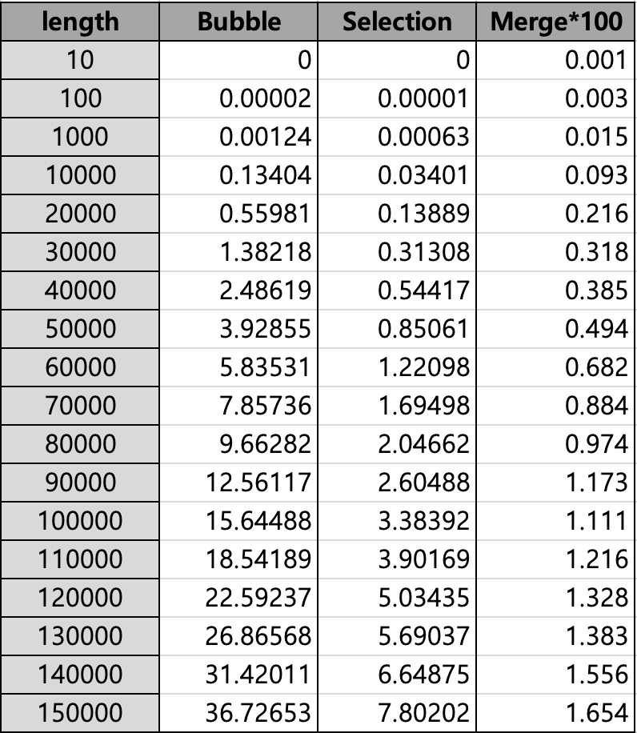
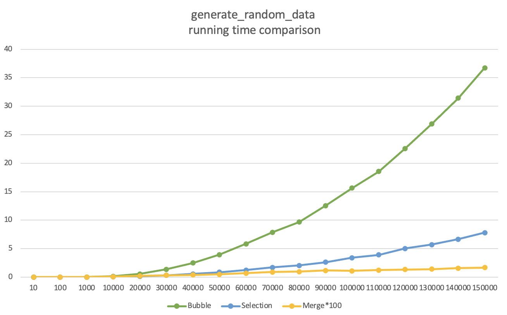
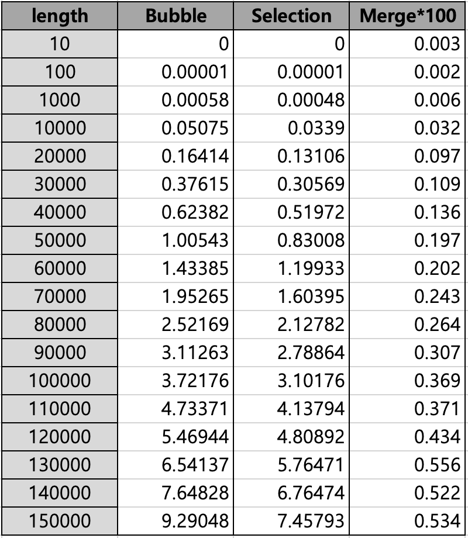
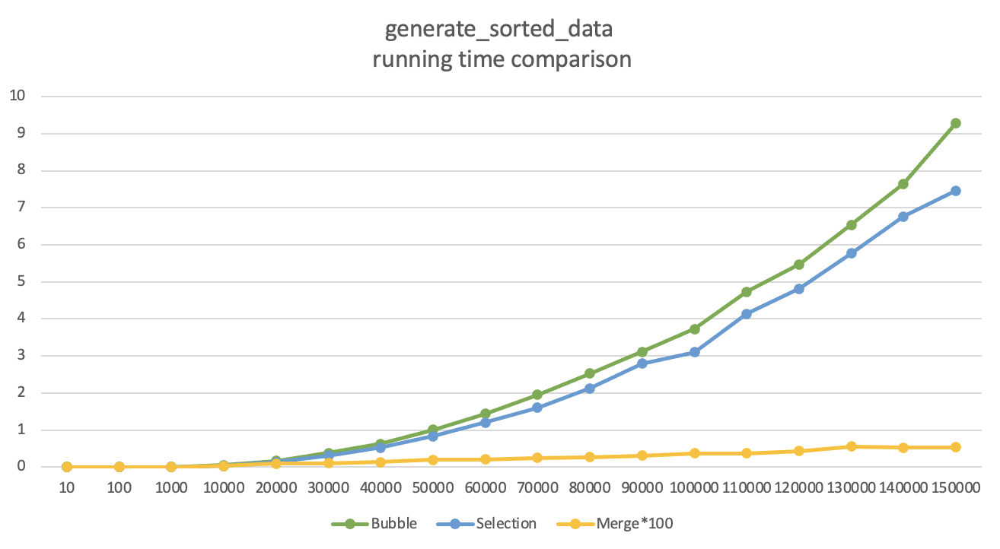

# 430.211 프로그래밍 방법론 : Project1

이 름 : 홍지현
 
 

# Introduction

## Sort Algorithm:
an algorithm that puts elements of a list in a certain order (mostly, numerical order).
 
 

## Time Complexity:
the computational complexity that describes the amount of computer time it takes to run a algorithm.

1. best case complexity (Omega Notation (Ω-notation))
- the lower bound of the running time of an algorithm
- ex) gen_sorted_data in project 1 
 

2. average case complexity (Theta Notation (Θ-notation))
- the upper and the lower bound of the running time of an algorithm
 

3. worst case complexity (Big-O Notation (O-notation))
- the upper bound of the running time of an algorithm
- it gives the worst-case running time of an algorithm -> widely used to analyze an algorithm as we don't know the random list that will be sorted.
- ex) gen_random_data in project 1 
 
 

# Experimental Results
 
<u> the running time of Merge sort is multiplied by 100 as the original time is too small to recognized on the graph. </u>
 
 

## Sorting random data
- Table (unit: second)
 

 

- Graph (x-axis: data length, y-axis: second)
 

 
 

## Sorting nearly sorted data
- Table (unit: second)
 

 

- Graph (x-axis: data length, y-axis: second)
 

 
 

# Analysis
 

## Sorting random data

### method: 
 

1. Sort 18 different length(min 10, max 150000) of randomly generated data, respectively by Bubble sort, Selection sort and Merge sort.
2. Compare running time of each sort algorithm.
 
 

### result:
 
<U><strong> Running time : Bubble sort > Selection sort >> Merge sort </strong></U>
 
 

- Bubble sort:
1. time complexity : O(n^2)
2. When sorting relatively small and unordered data set, the running time is similar to that of Selection sort and Merge sort. 
3. However, when it comes to a large number such as 50000 and more, Bubble sort becomes inefficient as it takes way more time than other two algorithms.
4. Average time and worst-case performance of Bubble sort is O(n^2), meaning that it is inefficient to sort large and unordered data.
 
 

- Selection sort:
1. time complexity : O(n^2)
2. It has the same time complexity with Bubble sort, but it always faster than Bubble sort.
3. When sorting a relatively small random data set, this algorithm is fast and efficient. (In such case, it is much more efficient than Bubble sort)
4. However, it takes long to sort large lists and generally performs the same way as Bubble sort.
 
 

- Merge sort:
1. time complexity : O(n log n)
2. it is highly efficient when sorting large data set, and of course small data set.
3. it is incomparably fast (compare to Bubble sort and Selection sort), and the difference becomes clearer as the number grows.
 
  

## Sorting nearly ordered data

### method: 
 

1. Sort 18 different length(min 10, max 150000) of nearly ordered data, respectively by Bubble sort, Selection sort and Merge sort.
2. Compare running time of each sort algorithm.
 
 

### result:
 
<U><strong> Running time : Bubble sort >= Selection sort >> Merge sort </strong></U>
 
 

-  Bubble sort:
1. time complexity : O(n^2)
2. When sorting a list of data of any length that is nearly sorted, Bubble sort is efficient and the running time is similar to that of Selection sort.
3. However, it is still time-consuming when sorting a large data(much slower than Merge sort).
 
 

- Selection sort:
1. time complexity : O(n^2)
2. The running time of Selection sort is similar to, but slightly faster than that of Bubble sort as the data set is nearly ordered.
3. The larger data is, the larger gap between Selection sort and Merge sort becomes.
 
 

- Merge sort:
1. time complexity : O(n log n)
2. It is the most efficient algorithm for sorting both random and nearly ordered data set among three algorithms. 
3. It is very quick when sorting data set regardless of the length of data.
 
 