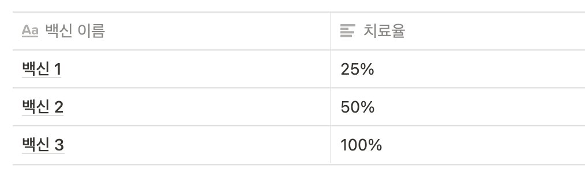
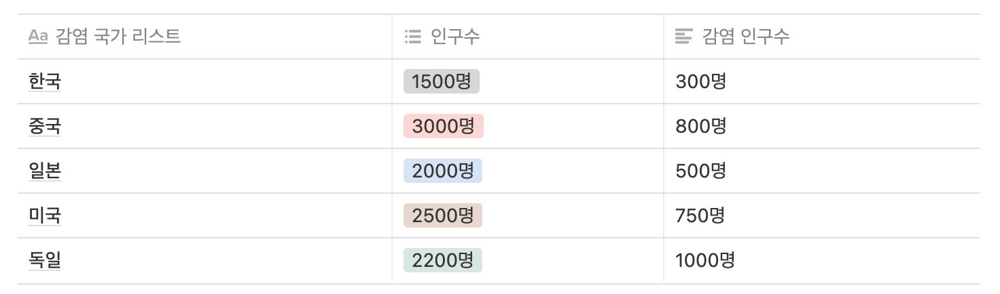

# 코로나 종식 게임

### 게임 배경

'도대체 코로나 바이러스 없는 날은 언제쯤 올까 ?... 백신이 언제 개발 될 지도 모르고 ㅠㅠ 그래 언제까지 이렇게 풀 죽어있을 순 없지 !! 내가 직접 코로나 바이러스를 종식시키는 게임을 만드는거야 !!!'

최근 코로나 바이러스 때문에 세계가 혼란에 빠져있다. 지호는 이를 극복하고자 하는 마음으로 코로나 종식 게임을 만들고자 한다. 출력화면을 바탕으로 아래의 조건에 맞게 구현하시오.
 
 

### 구현 기능
- 게임을 시작하면 4개의 메뉴창이 나온다.(백신 정보, 감염된 국가 정보, 게임 시작, 게임 종료)
- 1,2번 메뉴를 선택하면 초기에 설정된 백신과 감염된 국가 정보가 출력되고, 3번 메뉴를 선택하면 게임이 시작되며, 4번 메뉴를 누르면 게임을 종료한다.
- 3번 메뉴를 누르면 게임이 시작되는데 플레이어는 사용할 백신(1~3)과 백신을 적용할 국가(1~5)의 번호를 차례대로 입력한다.
- 라운드는 총 5개이며, 플레이어가 처음 백신과 국가의 번호를 선택하면 첫번째 라운드를 제외한 나머지 라운드는 자동으로 진행된다. 이 때 자동으로 진행되는 방식은 다음과 같다.
- 라운드가 끝나고 나서 백신 리스트와 국가 리스트의 데이터들은 무작위로 셔플된다.
- 셔플된 리스트에서 다음 라운드에 적용할 백신과 국가를 뽑아 적용한다.
- 위의 방식으로 게임이 진행되는데 라운드가 진행될 때마다 선택된 백신,나라들의 정보들을 출력하고, 만약 해당 라운드에서 완치된 국가가 존재하면 해당 국가를 출력하도록 한다.
- 매 라운드가 종료시 감염된 나라들의 정보를 출력한다. 만약 존재하지 않을 시 모든 국가가 완치되었다고 출력한다.
- 매 라운드가 종료될 시(마지막 라운드 제외), 완치된 국가 이외의 감염된 국가의 감염자 수는 해당 국가의 인구수의 15%만큼 증가된다. 이 때, 만약 감염자 수가 인구 수보다 많아진 국가가 생기면 게임은 바로 중단되고 최종 결과창으로 이동한다.
- 최종 결과를 출력하고 게임은 종료되는데, 최종 결과에서는 4개의 결과가 출력된다. 결과들은 다음과 같다.

    1. 라운드마다 추가로 감염된 감염자 수(정수)
    2. 백신으로 치료된 감염자 수(정수)
    3. 백신으로 완치된 국가(갯수 포함)
    4. 감염 인구수가 많은 순서대로 1위부터 5위까지 국가들의 정보를 출력한다. (완치된 국가끼리는 순위가 의미없으므로 무작위로 출력 가능)

 

 - 초기 백신 리스트, 감염 국가 리스트 표
 1. 백신 리스트

2. 감염 국가 리스트
