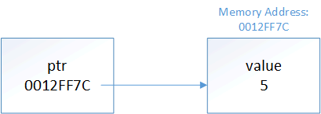

# 430.211 프로그래밍 방법론 LAB 08 : Arrays and Pointers 
담당조교 : 함도규   
이메일 : hdk971110@scale.snu.ac.kr   
2021년 3월 29일 월요일

## Introduction
Chapter 9.1-9.5, 9.8-9.11, 9.15-9.20의 내용인 Arrays, Pointers에 대한 내용을 다룬다.

## Arrays
### Array
#### 1-dimensional Array
``` c++
type name[size];
```

#### Multidimensional Array
``` c++
type name[size1][size2];
```

#### Initialization
``` c++
// one by one
int array[5];
array[0] = 1;
array[1] = 2;
array[2] = 3;
array[3] = 4;
array[4] = 5;

// uniform initialization
int brray[3] = {4,4,5};

// zero initialization
int crray[4] = { }; // every element is initialized to 0

// omit array length
int drray[] = {5, 5, 2, 1};
```

**Important**
* index는 0부터 시작.
* Array의 크기는 선언을 할 때 지정이 되어야 함.
* Array의 크기는 변경할 수 없다.

#### Array를 함수 인자로 전달
``` c++
// example
// pass a value
void passvalue(int value) {
  value = 100;
}
int val = 10;
std::cout << "before passing value : " << val << std::endl;
passvalue(val);
std::cout << "after passing value : " << val << std::endl;

// pass an array
void passarray(int arr[5]) {
  arr[0] = 0;
  arr[1] = 0;
  arr[2] = 0;
  arr[3] = 0;
  arr[4] = 0;
}
int arr[5] = {1,2,3,4,5};
std::cout << "before passing value : " << arr[0] << arr[1] << arr[2] << arr[3]\
    << arr[4] << std::endl;
passarray(arr);
std::cout << "after passing value : " << arr[0] << arr[1] << arr[2] << arr[3]\
    << arr[4] << std::endl;
```
* 단순 변수를 전달할 때는 전달하는 인자를 복사하여 전달하기 때문에 기존에 전달하는 변수에는 변화가 없다
* 하지만, array를 전달할 때에는 변수의 크기가 크기 때문에 복사하는데 필요한 공간의 크기가 크다.
* 따라서 실제 array를 전달...!
* 자세한 내용은 다음 시간에 pass by value, pass by refernece등에서 자세하게 배울 예정.

#### Size of array?
``` c++
void printSize(int array[])
{
    std::cout << sizeof(array) << '\n'; // prints the size of a pointer, not the size of the array!
}
 
int main()
{
    int array[] = { 1, 1, 2, 3, 5, 8, 13, 21 };
    std::cout << sizeof(array) << '\n'; // will print the size of the array
    printSize(array);
 
    return 0;
}
```
* Array를 전달할 때 크기도 같이 전달하려면 크기에 대한 인자도 함수에 포함하여주어야 한다!!

#### Array의 범위를 벗어난 경우에는??
``` c++
int array[3] = {1,2,3};
array[4] = 7 // ???
cout << array[4] << endl;
```
* Array의 접근 범위에 대해서는 잘 알고 있자!!
* Or, 다른 데이터 구조를 사용! --> preferred later on

## Pointers
* The address-of operator(&)
  어떤 메모리 주소가 변수에 할당되었는지를 알려줌.
* The dereference operator( * )
  특정한 주소에 있는 값에 접근할 수 있도록 함.

``` c++
#include <iostream>

int main()
{
    int x = 5;
    std::cout << x << '\n'; // print the value of variable x
    std::cout << &x << '\n'; // print the memory address of variable x
    std::cout << *(&x) << '\n'; // print the value at the memory address of variable x
                                // (parenthesis not required, but make it easier to read)

    return 0;
}
```
### Pointers
* Pointer는 메모리 주소값을 자신의 값으로 가지고 있는 변수.

#### Pointer 선언
``` c++
type* variable_name;
type *variable_name; // preferred
~~type * variable_name~~;

// 여러 개를 동시에 선언할 경우
int *a, *b; // two pointers to an int
int* a, b; // one pointer and one integer variable
```

**하지만, 함수의 경우에는?**
``` c++
int* do_something();
```
어떤 함수의 리턴 타입이 포인터인 경우에는 return type에 `*`를 붙이는게 좋다.

#### Pointer 값 할당
``` c++
int v = 5;
int *ptr = &v;
```


* 주의사항
1. Type을 매칭시켜줘야 한다.
2. 직접적으로 메모리 주소를 할당 할 수 없다.

#### The address-of operator(&)는 포인터를 리턴.
& operator는 직접적인 주소 값을 리턴하는 것이 아니라, 포인터를 리턴!

#### Dereferencing pointers
``` c++
int a = 5;
int *ptr = &a; // pointer to integer value. Now ptr is referencing a "a"
cout << ptr << endl;
cout << *ptr << endl; // Dereferencing pointer
```

#### The size of Pointers
* 사용하는 architecture에 따라 다르다. 32-bit or 64-bit
* Pointer는 단순히 주소를 저장하고 있기 때문에, 가리키고 있는 타입에 상관없이\
    동일한 architecture 안에서는 항상 동일한 크기를 갖는다.

#### nullptr
* int로 치면 0에 해당하는 pointer 변수
* NULL은 integer 타입이기 때문에 실제로 포인터를 사용할 때 0 값을 전달하기 때문에 에로사항이 발생할 수 있다.
* nullptr은 c++11에서 부터 제공되는 **포인터 타입**의 keyword.
* nullptr은 pointer가 아무것도 가리키고 있지 않다는 것을 명시적으로 나타냄.

## Array and pointer
* The fixed array will `decay`(be implicitly converted) into a pointer that points to the first element of the array.
``` c++
#include <iostream>

int main()
{
    int array[5]{ 9, 7, 5, 3, 1 };

    // print address of the array's first element
    std::cout << "Element 0 has address: " << &array[0] << '\n';

    // print the value of the pointer the array decays to
    std::cout << "The array decays to a pointer holding address: " << array << '\n';


    return 0;
}
```
* Array : int[5] 타입. 값은 각각의 element의 값.
* Pointer : int * 타입. 값은 array의 첫번째 element의 주소값.
* sizeof() 에서 타입의 차이를 알 수 있음.

### Access(deference) array using pointer
``` c++
int array[3] = {1,2,3};
int* ptr = array;
cout << *ptr << endl; // print out "1"
```
### Pointer arithmetic and Array indexing
#### Pointer arithmetic
``` c++
int a = 10;
int *ptr = &a;
cout << ptr << endl;
cout << ptr + 1 << endl;
cout << ptr + 2 << endl;
// 1씩 증가하지 않는다
```
* Pointer의 연산은 pointer가 가리키는 타입의 단위로 수행된다.
* 더하는 값에 pointer가 가리키는 타입의 크기만큼이 곱해져서(`scaling`) 연산된다.

#### Array indexing with pointer
* Pointer를 통해서 Array의 첫번째 element에 접근할 수 있음을 확인함.
* 따라서 Array의 나머지 element에도 pointer를 사용하여 접근할 수 있다!
``` c++
int a[10] = {0,1,2,3,4,5,6,7,8,9};
int *ptr = a;
// a[5]를 ptr를 사용하여 접근하려면?
cout << *(ptr+5) << endl; // ptr+5 = a[5]
```

## Const and Pointer
``` c++
// Pointer to const value
// Pointer를 사용하여 접근하는 값은 const로 간주되기 때문에 pointer를 사용한 값 변경은 불가능.
const int value = 5;
const int *ptr = &value; // O. 
*ptr = 6; // X. 우리가 가리키고 있는 변수가 const이기 때문에 바꿀 수 없다.

// Const pointer
int value = 5;
int *const ptr = &value; // ptr은 항상 value를 가리킴.
*ptr = 6; // 값은 바꿀 수 있다. non-const 변수를 가리키고 있기 때문.

// Const pointer to const value
int value = 5;
const int *const ptr = &value;
```

## References
* A reference is a type of C++ variable that acts as an `alias` to another object or value.
* & : "reference-to"
``` c++
int value = 8;
int &ref = value; // ref is a reference to value
cout << ref << endl;
cout << value << endl;
```
### References as alias(별명)
``` c++
int value = 8;
int &ref = value; // ref는 value를 지칭하는 또다른 이름
```
* value와 ref를 &(address-of) operator로 확인해보면 동일한 주소가 출력됨.
**Important**
* Reference는 무조건 선언과 동시에 초기화 해야한다.
* 한번 정의된 reference는 다시 다른 변수에 할당할 수 없다.

### References as function parameters
* 함수의 인자로 reference 가 전달될 때는 변수가 복사되는 것이 아니기 때문에 \
    함수 내에서 수정되는 값을 함수의 밖에서도 유지될 수 있도록 한다.
* **함수의 인자로 reference를 사용하면 변수의 불필요한 복사를 필요로 하지 않기 \
    때문에 되도록 reference를 사용하여 전달하도록 한다.**
* 자세한 내용은 다음 강의에서... :)

### Reference vs Pointer 
``` c++
int value{ 5 };
int *const ptr{ &value }; // ref는 한번 선언되면 재할당이 안되기 때문에 \ 
                            const pointer로 선언
int &ref{ value };
// ref = *ptr
```
* Reference가 선언 및 사용에 있어 제약이 많기 때문에 안전하기 때문에 특별한 경우를 제외하고는 reference를 선호.

### Memeber selection with pointers and references
* Member selection operator : `.`, `->`
``` c++
struct Person
{
    int age;
    double weight;
};
Person person; // define a person

// Member selection
person.age = 4;
Person &ref = person;
ref.age = 5;

Person *ptr = &person;
(*ptr).age = 3;
ptr->age = 2;
```

## for-each loop
* C++11부터 제공하는 새로운 형태의 for loop.
* `for-each` loop or `range-based` for-loop
``` c++
//for (element_declaration : array)
//  statement;
int array[5] = {4,1,9,8,3};
for (int a : array) { 
  cout << a << endl;
}
```
* auto 키워드를 사용하면 더 편하게 사용할 수 있다.
* for-each loop은 iterate하고자 하는 array의 크기를 알아야 하기 때문에 array pointer는 사용불가
* Indexing이 안된다는 단점이 있다.


## void pointer
* 어떤 타입이든 가리킬 수 있는 포인터!! 잘 사용하면 매우 유용하다.
``` c++
void *vptr;
int a = 5;
float a = 9.2;
char c = 't';

// all valid
vptr = &a;
vptr = &b;
vptr = &c;

// invalid
cout << *vptr << endl;
```
* 어떤 타입을 가리키고 있는지 모르기 때문에 역참조하는 것은 에러 발생.
* 명시적으로 타입을 지정해줘야 함.
``` c++
cout << *(static_cast<int*>(vptr)) << endl;
```

## Pointer to pointer and multidimensional array
### Pointer to pointer
``` c++
int a = 8;
int *ptr = &a;
int **ptrptr = &ptr;
cout << ptrptr << endl;
cout << *ptrptr << endl;
cout << **ptrptr << endl;
```

### Array of pointers
``` c++
// 포인터 변수를 갖는 array를 선언할 때
int **array = new int*[10];
```
