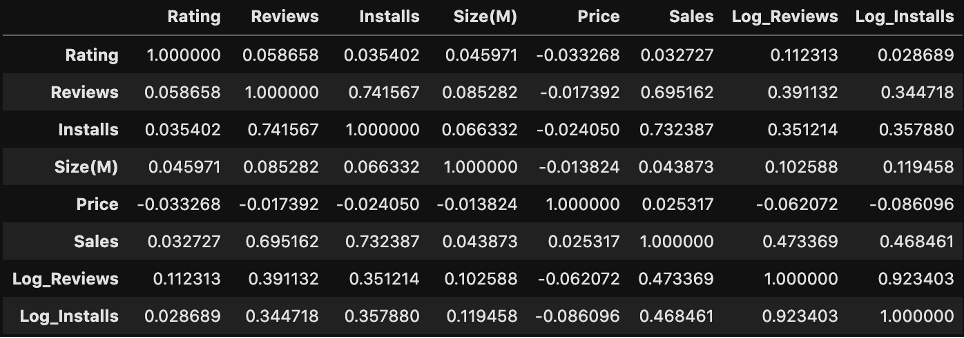
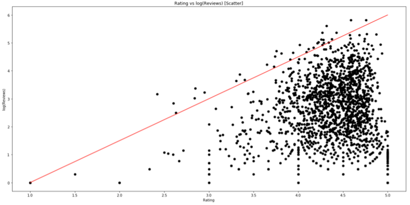
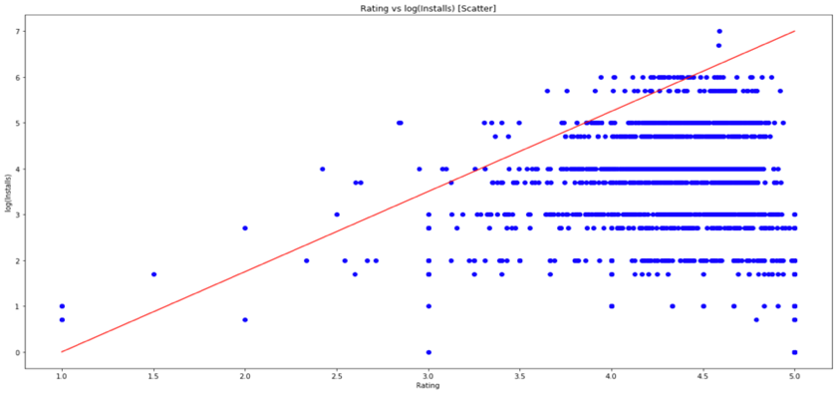
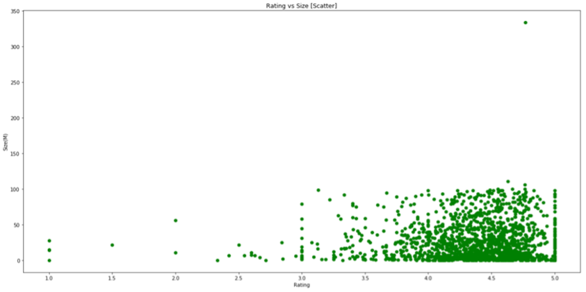
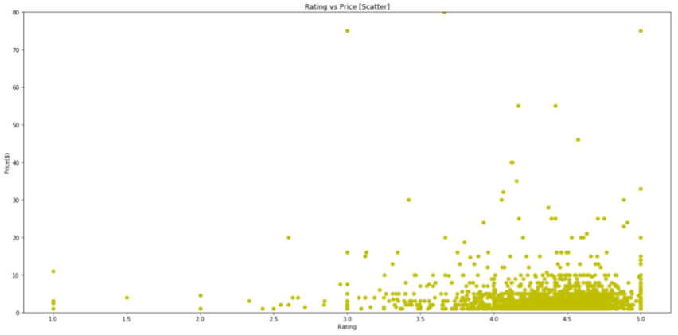
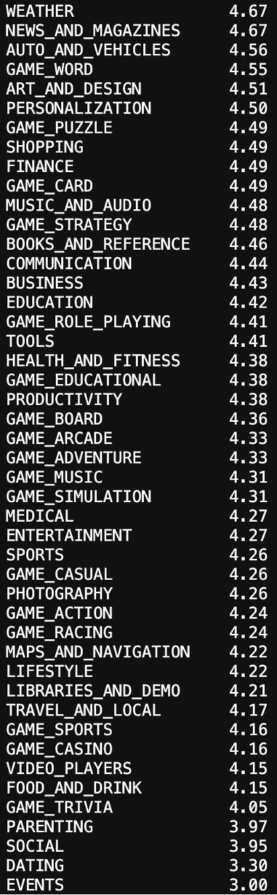
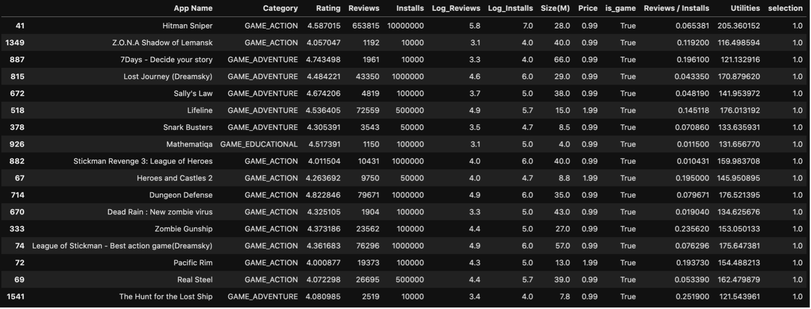
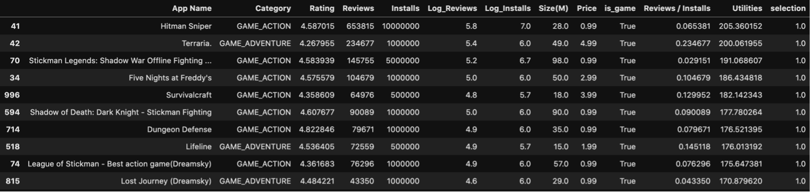

# 앱 스토어 어플 추천

## 프로젝트 설명
다음의 app_store.csv 데이터는 신 사업으로 어플 추천 시스템을 개발하는 스타트업인 G사가 다양한 어플에 대한 특성 정보와 사용자 평가 정보를 확보하여 정리한 데이터이다. 
※ Rating은 평점, Reviews는 리뷰의 수, Installs는 설치된 수, Size는 앱의 용량, 그리고 Price는 앱의 가격이다.

- 1-1) Rating 변수와 상관관계를 분석할 수 있는 변수를 찾고, 그들이 어떠한 관계를 갖는지 이유와 함께 설명해주세요. (시각 자료 및 코드를 제외한 답안의 길이는 한 페이지 이내로 제한해주세요.) 
 
 

- 1-2) 250번 (Five Nights at Freddy's 4), 532번 (PAW Patrol Pups to the Rescue), 1664번 (My Town : Farm)  어플을 사용하는 고객이 만족할 만한 어플을 추천해주는 전략을 구체적인 추천 목록과 함께 제시해주세요. 
 
단, 이 고객의 잔여 용량은 500M(500,000k), 예산 범위는 20달러로 추천하는 어플들의 용량과 가격 총합이 제시된 제한 범위를 넘어서는 안 됩니다. / 고객이 만족할 만한 어플에 대한 기준은 자유롭게 설정하시고 그 근거를 설명해주시면 됩니다. (시각 자료 및 코드를 제외한 답안의 길이는 두 페이지 이내로 제한해주세요.)

 
 

## 코드 및 알고리즘 설명  
[1번] App_store data
[데이터 전처리 (preprocessing)]
- Installs의 데이터 형식에 1,000,000+와 같이 쉼표 및 덧셈 기호가 포함되어 있는 관계로 이를 모두 삭제했다.
- Reviews, Installs의 규모가 상대적으로 너무 큰 관계로 (Rating이 1~5인 반면 이 둘은 수십만 이상의 scale) 상용로그(np.log10)를 씌웠다.
- Size의 데이터 형식에 M, k와 같은 문자가 섞여 있는 관계로 이를 삭제하고, 메가바이트 단위로 일관되게 바꿨다.
- Price의 데이터 형식에 '달러표시'가 섞여 있는 관계로 $를 삭제했다.
- Reviews / Installs (설치 횟수 대비 리뷰 개수) 지표를 추가했다.
- Utilities 지표를 추가했다. (1-2에서 자세히 설명)
  

[1-1]  
Rating 변수와 상관관계가 존재하는 변수는 주어진 데이터 내에서 발견되지 않았다. 아래 표는 데이터의 각 column들끼리의 Pearson 상관계수를 구한 것이다. (참고 : Sales = Price x Installs. 본인이 추가해본 지표)
  

 
[표 1 피어슨 상관계수]
  

안타깝게도, Rating과 타 지표들 간의 상관계수는 거의 0.1 조차 넘지 못 했으며, 산점도 그래프(scatter)로 그려보아도 뚜렷한 양상을 관찰하기 어려웠다. (그림 1, 2, 3, 4) 참고로 그림 2의 파란 점들이 가로줄 모양으로 늘어져 있는 이유는 Installs 데이터가 애초에 몇 이상인지(예 : 10,000+)로만 쓰여졌기 때문이다. 실제 값으로부터 어느 정도 왜곡되어 있다는 점을 감안해야 한다.

* 참고 : 그림 1, 2의 빨간 선들은 각각 (1,0), (5,6)을 이은 것과 (1,0), (5,7)을 이은 것이다(중요한 의미를 갖는 직선은 아니다). 데이터 분포가 빨간 선 밑에서 주로 형성됨을 확인할 수 있지만, 이것이 둘 사이의 강한 상관관계를 말해주지는 않는다. 

 

 
[그림 1 Rating vs Log(Reviews)]
  

 

 
[그림 2 Rating vs Log(Installs)]
  

 

 
[그림 3 Rating vs Size]
  

 

 
[그림 4 Rating vs Price]
  

 

 
[그림 5 Category별 평균 Rating]
  

 

[1-2]  
본 문제는 주어진 제약조건 두 개를 충족시키면서 고객의 편의 & 만족도를 최대로 만들어야 하는 최적화 문제이다.  
    - Constraints : 용량의 총합 500M 이하, 가격의 총합 $20 이하.  
    - Utilities 지표에 관한 설명 
 

Utilities(추천 점수)란 objective function을 나타내는 지표이다. 단순히 Rating의 총합을 maximize하면 어떠냐는 의견도 존재할 수 있다. Rating지표는 사용자가 앱에 대해 내린 평가의 의미를 담고 있기 때문이다. 그러나 Rating만으로는 앱의 가치/유용성을 판단하기에 불충분하다고 생각한다. 
예를 들어, 가격 $7, 평점 4.5의 앱 A가 있고, 가격 $1, 평점 4.5의 앱 B가 있다고 하자. Rating 관점으로만 보자면 두 앱은 동등한 위치를 가지고 있으며, 둘 중 무엇을 추천해도 무방해야 할 것이다. 이 경우 추천에 대한 정답이 있는 것은 아니지만, 개인적으로는 $7짜리인 A에 더 높은 점수를 부여하고 싶으며 나라면 A를 사용자에게 추천할 것이다. 그 이유는 크게 두 가지가 있다.
 
1. 앱 B의 가격을 $7로 갑자기 올리면, B의 평점이 여전히 4.5를 유지할 수 있을까? 
      -> 아마 내려갈 것이다.  
2. 앱 A의 가격을 $1로 갑자기 내리면, A의 평점이 여전히 4.5에 머무를까? 
     -> 아마 올라갈 것이다. 

보다 복잡한 경제 이론을 도입하면 앱들의 가치를 매기는 작업이 더 정밀해 질 수 있겠지만, 본 풀이에서는 지금까지 논의한 내용에 초점을 맞추어 Utilities라는 새로운 추천 지표를 개발하였다.  
Utilities는 Rating * 20 * (Price + 1) / 21 + Log(Reviews) * 100 / 6 + Log(Installs) * 100 / 7로 정의된다.  
첫 번째 항은 Rating을 Price와 함께 반영하기 위함이고, $20 초과의 앱은 어차피 고려 대상이 아니므로 최대 100점 만점의 지표이다. (Price + 1을 한 이유: 주어진 데이터는 모두 유료 어플이지만, 만약 무료 어플이 있을 경우 Price가 0이 되고 첫번째 항이 0이 되어버려 Rating의 정보가 소실됨.) 그러나 안타깝게도, 이 항만으로는 추천 시스템을 구성하는 것이 곤란하다. 가령 1시간 전에 막 스토어에 등록된 앱이 설치/리뷰 1회, 평점 5점, 게다가 가격이 $100 이상의 고가 앱이라면 첫 번째 항에서 어마어마한 추천 점수를 챙길 수 있다. 굉장히 부자연스러운 상황이다. 우리는 평가의 목적보다 추천의 목적을 더 신경 써야 하기 때문에, 추가로 두 개의 다른 항을 도입했다.  
두 번째 항은 Reviews를 날 것 (Raw) 그대로 반영하기 곤란한 관계로 Log를 취해준 뒤 이를 100점 만점으로 환산한 지표이다. 세 번째 항은 같은 작업을 Installs에 취한 것이다. 많은 수의 설치/리뷰는 (+ 좋은 Rating까지 더해진다면) 추천의 신뢰성을 높일 수 있으며, 위에서 제시한 사례를 걸러낼 수 있다.

- 참고 : 100점이 엄밀한 의미에서의 만점은 아니다. 본 데이터를 기준으로 Log(Reviews)가 모두 6이하, Log(Installs)가 모두 7이하가 나왔기 때문에, 단지 이들이 지닐 수 있는 (명목상) 상한선을 정해둔 것 뿐이다. 만약 Installs 1억 회, Reviews 1천만 회 이상인 앱을 데이터에 추가한다면 총 만점 300점을 넘는 상황이 나올 수도 있다(풀이의 타당성에는 전혀 영향을 미치지 않음). 결론적으로 Utilities 지표는 사실상 300점 만점으로 계산된다.

- 그 외의 추가 조치 
추천 카테고리는 이미 설치한 세 개의 앱의 카테고리와 동일한 것으로 제한했다.
Rating이 4.0 미만이거나, Installs가 10000회 미만인 것은 아예 배제했다.
Reviews / Installs가 1 초과인 데이터는 outlier로 판단하여 제거했다.

- IP(Integer Programming) 풀기 
Cvxpy 라이브러리를 사용하여 제약조건 하에서 utilities의 합을 최대로 만드는 선택(selection)을 찾았다. 여기서 selection 변수는 boolean인데, 0 (선택 안 함) 아니면 1 (선택함)의 값들로 이루어져 있다.  
추가로 constraint를 하나 더 설정해주었는데, 바로 선택의 개수 제한이다.
개수를 딱히 제한하지 않고 해를 찾으면 그림 6의 결과가 나오며, 이 때 사용한 용량은 499.1M, 예산은 $19.83이다.
개수를 10개로 제한하고 해를 찾으면 그림 7의 결과가 나오며, 이 때 사용한 용량은 469.0M, 예산은 $19.9이다.
용량을 덜 사용했다는 점에서 후자와 같은 추천을 낮게 평가할 수 있지만, 실상은 다르다.  
실제 추천 앱들의 목록을 살펴보면, 개수를 제한하지 않은 경우 Rating 4.0 근처의 여러 앱들이 추천 대상에 포함되어 있음을 알 수 있다. 10개로 제한된 case에 비해 평균적인 Quality가 떨어진다는 의미이기도 하다. 다시 말해, 용량과 가격을 tight하게 맞추는 것을 약간 포기하더라도, 엄격한 개수 제한을 통해 High-Quality 앱들을 추천하는 것이 더 낫다는 판단 하에 constraint_3을 추가한 것이다.

 

- 결과

 
[그림 6 추천 수 제한 없는 경우]
  

 

 
[그림 7 추천 수 10개로 제한하는 경우 : 최종 추천 목록]
  